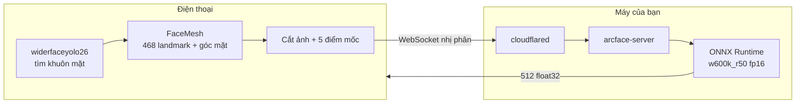

# Tự host ArcFace: WebSocket API + Cloudflare Tunnel

> **Đã lỗi thời ở phần giao thức.** Backend đã chuyển sang REST (`POST /embed`,
> body JSON, 1-8 mặt mỗi lần) — xem `CLIENT_MIGRATION.md`. App không còn nói
> WebSocket, và §5 (giao thức), §6.4 (heartbeat) cùng phần `server.py` dựng
> socket ở đây không còn mô tả hệ thống đang chạy.
>
> Phần vẫn còn đúng và vẫn đáng đọc: §2 (chọn model), §3 (mẫu căn chỉnh 5 điểm),
> §7 (an ninh), §9 (ngân sách độ trễ), §10 (đặt tên phiên bản model), §11 (hiệu
> chỉnh ngưỡng). Giữ lại vì đó là lý do đằng sau các con số app đang dùng.

Đưa bước sinh embedding khuôn mặt ra khỏi điện thoại, chạy trên máy của bạn, gọi
qua WebSocket công khai bằng Cloudflare Tunnel.

Ưu tiên của tài liệu này là **tốc độ** và **độ chính xác**, theo đúng thứ tự bạn
yêu cầu — nhưng có một đánh đổi không né được, nói ngay ở đây: chuyển sang server
là **bỏ khả năng nhận diện khi mất mạng**. Hiện `readFace` chạy trọn trên máy, có
mạng hay không cũng nhận diện được. Sau khi chuyển, mất mạng nghĩa là mọi khuôn
mặt đều trả về "không đọc được". Mục [§8](#8-sửa-phía-app) nói cách giữ đường lùi.

---

## 0. Đọc trước khi làm bất cứ thứ gì

**1. Đổi model là mất toàn bộ dữ liệu đã đăng ký.** Embedding của hai model khác
nhau **không so sánh được** — không phải "kém chính xác hơn", mà là vô nghĩa: hai
vector 512 chiều nằm trong hai không gian không liên quan. Cosine giữa chúng ra
một con số trông rất hợp lý và hoàn toàn ngẫu nhiên. Mọi hàng trong
`face_profiles` phải **đăng ký lại**. Xem [§10](#10-đánh-phiên-bản-model-trong-db)
để bảng dữ liệu tự bảo vệ mình khỏi lỗi này thay vì trông chờ trí nhớ.

**2. Đây là dữ liệu sinh trắc học.** Ảnh khuôn mặt và embedding thuộc nhóm dữ
liệu nhạy cảm đặc biệt (GDPR Art. 9; Nghị định 13/2023/NĐ-CP về bảo vệ dữ liệu cá
nhân). Một endpoint **công khai** nhận ảnh mặt là một mục tiêu, không phải một
tiện ích. Không có xác thực thì bất kỳ ai tìm thấy tên miền đều gửi được ảnh mặt
người khác vào máy bạn. [§7](#7-bảo-mật) là phần bắt buộc, không phải tuỳ chọn.

**3. Cloudflare Tunnel đóng WebSocket sau 100 giây không có dữ liệu** (gói Free và
Pro). Không có heartbeat thì kết nối chết đúng lúc người dùng để máy nghỉ một lát
rồi quét tiếp — [§6.4](#64-heartbeat-bắt-buộc).

---

## 1. Ranh giới: cái gì ở lại máy, cái gì lên server



| Việc | Ở đâu | Vì sao |
|---|---|---|
| Dò khuôn mặt (yolo26) | **Máy** | Chạy mỗi lần quét, gửi cả khung hình lên mạng thì vừa chậm vừa lộ nhiều hơn cần thiết |
| FaceMesh: góc mặt + landmark | **Máy** | 0.6M tham số, GPU delegate 99/99 node, gần như miễn phí. Nó cũng là cổng chặn: mặt nghiêng quá thì **không gửi đi đâu cả** |
| Cắt ảnh + 5 điểm mốc | **Máy** | Chỉ gửi ~6KB thay vì cả khung hình |
| Căn chỉnh (affine warp) | **Server** | Cần đúng template của ArcFace và phép nội suy tử tế; OpenCV làm chuẩn hơn Skia ở đây |
| Sinh embedding | **Server** | Chính là thứ đang chậm trên máy |
| So khớp | **Máy** (giữ nguyên) | Xem [§8.3](#83-có-nên-đưa-cả-so-khớp-lên-server-không) |

Điểm mấu chốt về độ chính xác: **cổng góc mặt chạy trước, trên máy**. Mặt nghiêng
quá thì không tốn một byte mạng nào. Đây cũng là logic đang có trong
`src/detection/faceEmbed.ts`, không phải thêm mới.

---

## 2. Chọn model

**Đừng convert `arcface.tflite` hiện có sang ONNX.** File đó là một Vision
Transformer (72 `BATCH_MATMUL`, 12 `SOFTMAX`, chỉ 1 `CONV_2D`) mà GPU delegate
không phân vùng nổi — xem `assets/models/README.md`. Chuyển nó lên server chỉ là
mang cái chậm sang chỗ khác, và giữ nguyên một ẩn số: không đọc được từ graph là
nó được huấn luyện với dải giá trị nào.

Dùng bản gốc của InsightFace:

| Gói | File nhận diện | Kích thước | Ghi chú |
|---|---|---|---|
| **buffalo_l** | `w600k_r50.onnx` | ~166MB | ResNet50, tập Glint360K. **Khuyến nghị** khi ưu tiên độ chính xác |
| buffalo_s | `w600k_mbf.onnx` | ~13MB | MobileFaceNet, nhanh hơn nhiều, chính xác kém hơn rõ |

```bash
pip install -U insightface onnxruntime-gpu
python - <<'PY'
from insightface.app import FaceAnalysis
FaceAnalysis(name='buffalo_l')   # tải về ~/.insightface/models/buffalo_l/
PY
ls ~/.insightface/models/buffalo_l/
```

Chỉ cần `w600k_r50.onnx`. Các file còn lại trong gói là detector và landmark —
việc đó điện thoại đã làm rồi.

### Tiền xử lý (đọc thẳng từ mã nguồn InsightFace, không phải quy ước truyền miệng)

| | |
|---|---|
| Input | `[1, 3, 112, 112]` float32, **NCHW** |
| Thứ tự kênh | **RGB** (`cv2.dnn.blobFromImages(..., swapRB=True)` từ ảnh BGR) |
| Chuẩn hoá | `(x - 127.5) / 127.5`, tức dải **-1..1** |
| Output | 512 float32, **chưa chuẩn hoá** — phải tự L2 normalise |

Dải -1..1 này chính là `SIGNED_RANGE` mà app đang đoán cho model tflite. Ở đây nó
không còn là phỏng đoán nữa — đây là bản chính thức.

---

## 3. Căn chỉnh: nơi độ chính xác thật sự được quyết định

ArcFace được huấn luyện trên ảnh đã warp về đúng một template. Đưa cho nó một ô
vuông cắt thô, cùng một người vẫn khớp với chính mình, nhưng khoảng cách tới người
lạ hẹp lại — tức là sai theo hướng đắt nhất.

Template 112×112 của InsightFace (`arcface_dst`), thứ tự **cố định**:

```python
ARCFACE_DST = np.array([
    [38.2946, 51.6963],   # 0 mắt trái  (trái theo ảnh, tức x nhỏ hơn)
    [73.5318, 51.5014],   # 1 mắt phải
    [56.0252, 71.7366],   # 2 chóp mũi
    [41.5493, 92.3655],   # 3 khoé miệng trái
    [70.7299, 92.2041],   # 4 khoé miệng phải
], dtype=np.float32)
```

Điện thoại đã có 468 landmark, nên nó gửi kèm 5 điểm rút ra từ đó:

| Điểm | Chỉ số FaceMesh | Cách tính |
|---|---|---|
| Một mắt | 33, 133 | trung bình hai khoé mắt |
| Mắt kia | 362, 263 | trung bình hai khoé mắt |
| Mũi | 1 | lấy thẳng |
| Một khoé miệng | 61 | lấy thẳng |
| Khoé miệng kia | 291 | lấy thẳng |

**Không gán cứng cặp nào là "trái".** `fivePoints()` **sắp xếp theo x** rồi mới
trả về: 33/133 là mắt phải của chủ thể nên trong ảnh thường nằm ở x nhỏ hơn,
nhưng camera trước lật ảnh và nó đổi sang phía kia — trong khi template thì
không đổi. Điểm nào có x nhỏ hơn thì vào ô 0, đúng trong cả hai trường hợp.

> **Server vẫn tự kiểm tra lần nữa.** Client đã sắp xếp theo x rồi, nhưng phép
> hoán đổi ba dòng trong `align()` vẫn giữ: nó rẻ, và nó là thứ duy nhất bảo vệ
> server trước một client viết ẩu. Sai chiều thì `estimateAffinePartial2D`
> không báo lỗi — phép biến đổi tương tự **không lật được**, nên nó lặng lẽ khớp
> một phương án dung hoà và embedding trôi đi. Đúng loại lỗi không có thông báo.

---

## 4. Server

### 4.1 Cài đặt

```bash
mkdir -p ~/arcface-server && cd ~/arcface-server
python -m venv .venv && source .venv/bin/activate
pip install "fastapi>=0.110" "uvicorn[standard]>=0.29" numpy opencv-python-headless onnxruntime-gpu
cp ~/.insightface/models/buffalo_l/w600k_r50.onnx ./
```

Không có GPU NVIDIA thì đổi `onnxruntime-gpu` → `onnxruntime`. Server vẫn chạy,
chỉ chậm hơn — xem bảng ở [§9](#9-ngân-sách-độ-trễ).

### 4.2 `server.py`

```python
import asyncio, json, os, struct, time
import cv2, numpy as np, onnxruntime as ort
from fastapi import FastAPI, WebSocket, WebSocketDisconnect

MODEL = os.environ.get("ARCFACE_MODEL", "w600k_r50.onnx")
TOKEN = os.environ["ARCFACE_TOKEN"]          # bắt buộc, không có mặc định
SIZE = 112
MAX_BYTES = 2 * 1024 * 1024                  # ảnh crop không bao giờ tới mức này

ARCFACE_DST = np.array([
    [38.2946, 51.6963], [73.5318, 51.5014], [56.0252, 71.7366],
    [41.5493, 92.3655], [70.7299, 92.2041],
], dtype=np.float32)

# TensorRT trước, CUDA sau, CPU cuối. ORT tự lùi xuống provider kế tiếp nếu
# provider trên không dựng được, nên danh sách này an toàn trên mọi máy.
PROVIDERS = [
    ("TensorrtExecutionProvider", {"trt_fp16_enable": True,
                                   "trt_engine_cache_enable": True,
                                   "trt_engine_cache_path": "./trt-cache"}),
    ("CUDAExecutionProvider", {}),
    "CPUExecutionProvider",
]

opts = ort.SessionOptions()
opts.graph_optimization_level = ort.GraphOptimizationLevel.ORT_ENABLE_ALL
session = ort.InferenceSession(MODEL, opts, providers=PROVIDERS)
INPUT = session.get_inputs()[0].name
print("providers:", session.get_providers(), flush=True)

# Lần chạy đầu của TensorRT tốn hàng chục giây để dựng engine. Làm lúc khởi
# động, không phải lúc người dùng đầu tiên bấm quét.
session.run(None, {INPUT: np.zeros((1, 3, SIZE, SIZE), dtype=np.float32)})
print("warmed up", flush=True)


def align(img: np.ndarray, kps: np.ndarray) -> np.ndarray:
    """Warp ảnh crop về đúng template 112x112 của ArcFace."""
    # Camera trước lật ảnh; template xếp theo toạ độ ảnh nên phải sửa lại.
    if kps[0][0] > kps[1][0]:
        kps = kps[[1, 0, 2, 4, 3]]
    M, _ = cv2.estimateAffinePartial2D(kps, ARCFACE_DST, method=cv2.LMEDS)
    if M is None:
        raise ValueError("khong uoc luong duoc phep bien doi")
    return cv2.warpAffine(img, M, (SIZE, SIZE), flags=cv2.INTER_LINEAR,
                          borderValue=0.0)


def embed(faces: list[np.ndarray]) -> np.ndarray:
    """faces: list ảnh BGR 112x112 -> ma trận (n, 512) đã L2 normalise."""
    blob = cv2.dnn.blobFromImages(faces, 1.0 / 127.5, (SIZE, SIZE),
                                  (127.5, 127.5, 127.5), swapRB=True)
    out = session.run(None, {INPUT: blob})[0]
    return out / np.linalg.norm(out, axis=1, keepdims=True)


app = FastAPI()


@app.get("/health")
def health():
    return {"ok": True, "providers": session.get_providers(), "model": MODEL}


@app.websocket("/embed")
async def embed_socket(ws: WebSocket):
    if ws.headers.get("authorization") != f"Bearer {TOKEN}":
        await ws.close(code=4401)
        return
    await ws.accept()

    try:
        while True:
            frame = await ws.receive_bytes()
            if len(frame) > MAX_BYTES:
                await ws.close(code=1009)
                return

            (head_len,) = struct.unpack_from("<I", frame, 0)
            head = json.loads(frame[4:4 + head_len])
            payload = frame[4 + head_len:]
            req_id = head.get("id", 0)
            t0 = time.perf_counter()

            try:
                img = cv2.imdecode(np.frombuffer(payload, np.uint8),
                                   cv2.IMREAD_COLOR)
                if img is None:
                    raise ValueError("khong giai ma duoc anh")
                kps = np.array(head["kps"], dtype=np.float32).reshape(5, 2)
                vec = embed([align(img, kps)])[0].astype(np.float32)
            except Exception as e:                       # noqa: BLE001
                await ws.send_bytes(_pack({"id": req_id, "error": str(e)}, b""))
                continue

            ms = (time.perf_counter() - t0) * 1000
            await ws.send_bytes(
                _pack({"id": req_id, "dim": 512, "ms": round(ms, 2)},
                      vec.tobytes())
            )
    except WebSocketDisconnect:
        pass


def _pack(head: dict, body: bytes) -> bytes:
    raw = json.dumps(head, separators=(",", ":")).encode()
    return struct.pack("<I", len(raw)) + raw + body
```

Chạy:

```bash
ARCFACE_TOKEN="$(openssl rand -hex 32)" .venv/bin/uvicorn server:app --host 127.0.0.1 --port 8765
```

> `--host 127.0.0.1`, **không phải** `0.0.0.0`. Chỉ `cloudflared` cần chạm tới nó.
> Mở ra toàn mạng LAN là mở thêm một cửa không ai canh.

### 4.3 Chạy nền bằng systemd

`/etc/systemd/system/arcface.service`:

```ini
[Unit]
Description=ArcFace embedding server
After=network.target

[Service]
User=%i
WorkingDirectory=/home/%i/arcface-server
Environment=ARCFACE_TOKEN=dan-token-that-vao-day
ExecStart=/home/%i/arcface-server/.venv/bin/uvicorn server:app --host 127.0.0.1 --port 8765
Restart=always
RestartSec=3

[Install]
WantedBy=multi-user.target
```

```bash
sudo systemctl enable --now arcface@$USER
curl -s localhost:8765/health | jq
```

`providers` trong kết quả phải có `TensorrtExecutionProvider` hoặc
`CUDAExecutionProvider`. Nếu chỉ thấy `CPUExecutionProvider` thì GPU **không**
được dùng — đừng đo hiệu năng rồi kết luận vội, sửa cài đặt trước.

---

## 5. Giao thức WebSocket

Một khung nhị phân, không base64. Base64 làm phình 33% dữ liệu, mà đây đúng là
phần đắt nhất trên đường truyền di động.

```
[u32 little-endian: độ dài header][header JSON UTF-8][phần thân]
```

**Yêu cầu** — thân là ảnh crop đã mã hoá JPEG:

```json
{ "id": 7, "kps": [[x0,y0],[x1,y1],[x2,y2],[x3,y3],[x4,y4]] }
```

`kps` tính theo **pixel của chính ảnh crop** gửi kèm, không phải theo khung hình
gốc, không phải 0..1.

**Trả lời** — thân là 512 số float32 little-endian (2048 byte):

```json
{ "id": 7, "dim": 512, "ms": 3.4 }
```

**Lỗi** — thân rỗng:

```json
{ "id": 7, "error": "khong giai ma duoc anh" }
```

`id` cho phép gửi nhiều khuôn mặt cùng lúc mà không cần chờ từng cái. Ảnh nhóm 8
người: bắn 8 yêu cầu rồi gom kết quả theo `id`, thay vì 8 vòng khứ hồi nối đuôi.

### Nén ảnh: JPEG hay raw?

| | Dung lượng | Khi nào |
|---|---|---|
| JPEG q95 | ~5–8KB | **Mặc định.** Qua Internet, băng thông là nút cổ chai |
| PNG | ~40KB | Khi cần chứng minh nén không ảnh hưởng độ chính xác |
| Raw RGB | 112×112×3 = 37KB | Chỉ khi chạy trong LAN |

Gửi crop **có biên** (`FACE_CROP_MARGIN` = 1.25 như app đang cắt) chứ đừng gửi ô
112×112 cắt sẵn: server còn phải warp, mà warp một ảnh đã cắt sát viền thì mép
ngoài không có pixel để lấy.

---

## 6. Cloudflare Tunnel

### 6.1 Cài và đăng nhập

```bash
# Debian/Ubuntu
curl -fsSL https://pkg.cloudflare.com/cloudflare-main.gpg | sudo tee /usr/share/keyrings/cloudflare-main.gpg >/dev/null
echo "deb [signed-by=/usr/share/keyrings/cloudflare-main.gpg] https://pkg.cloudflare.com/cloudflared any main" | sudo tee /etc/apt/sources.list.d/cloudflared.list
sudo apt update && sudo apt install cloudflared

cloudflared tunnel login
cloudflared tunnel create arcface
```

Lệnh `create` in ra UUID và đường dẫn file credentials — cần cả hai ở bước sau.

### 6.2 Cấu hình

`~/.cloudflared/config.yml`:

```yaml
tunnel: <UUID-vừa-tạo>
credentials-file: /home/<user>/.cloudflared/<UUID>.json

ingress:
  - hostname: arcface.tenmiencuaban.com
    service: http://127.0.0.1:8765
    originRequest:
      connectTimeout: 10s
      # TCP keepalive giữa cloudflared và server. Lưu ý đây KHÔNG phải cách
      # tránh mốc 100 giây: mốc đó nằm ở biên Cloudflare và chỉ tính lưu lượng
      # WebSocket thật, nên chỉ heartbeat ở tầng ứng dụng (§6.4) mới cứu được.
      tcpKeepAlive: 30s
  - service: http_status:404
```

`service: http://...` là đúng, không phải `ws://` — nâng cấp lên WebSocket đi qua
chính kết nối HTTP đó.

```bash
cloudflared tunnel route dns arcface arcface.tenmiencuaban.com
sudo cloudflared service install
sudo systemctl status cloudflared
```

### 6.3 Kiểm tra

```bash
curl -s https://arcface.tenmiencuaban.com/health | jq
```

### 6.4 Heartbeat (bắt buộc)

Cloudflare gói **Free và Pro đóng WebSocket sau 100 giây không có dữ liệu theo cả
hai chiều**. Business/Enterprise chỉnh được, các gói khác thì không.

Triệu chứng nếu bỏ qua: mọi thứ chạy tốt trong lúc test (vì bạn quét liên tục), rồi
người dùng để máy nghỉ hai phút, quét tiếp và nhận về lỗi kết nối — bug chỉ xuất
hiện khi có người dùng thật.

Client phải tự gửi ping mỗi **30 giây**. WebSocket của React Native không phơi ra
ping/pong ở tầng giao thức, nên gửi một khung nhị phân rỗng và cho server bỏ qua:

```ts
// phía client
const beat = setInterval(() => {
  if (ws.readyState === WebSocket.OPEN) ws.send(new ArrayBuffer(0));
}, 30_000);
```

```python
# phía server, ngay sau receive_bytes
if len(frame) == 0:
    continue
```

---

## 7. Bảo mật

Đây là endpoint công khai nhận ảnh khuôn mặt. Tối thiểu:

- [ ] **Token bắt buộc** — server ở trên từ chối kết nối thiếu `Authorization`
      (mã đóng 4401). Token sinh bằng `openssl rand -hex 32`, để trong biến môi
      trường, **không** commit vào repo. `.env` của repo này đã nằm trong
      `.gitignore` — giữ nguyên như vậy.
- [ ] **Cloudflare Access** đứng trước tunnel (khuyến nghị mạnh). Service token
      của Access chặn ngay ở biên Cloudflare, tấn công không chạm được tới máy
      bạn. Miễn phí tới 50 người dùng.
- [ ] **Giới hạn kích thước** — `MAX_BYTES` ở trên; thêm WAF rate limit trên
      Cloudflare theo IP.
- [ ] **Không ghi log ảnh.** Cám dỗ lớn nhất khi debug là `cv2.imwrite` một cái
      cho dễ xem. Đó là lúc máy bạn biến thành kho dữ liệu sinh trắc học không
      ai quản. Muốn debug thì log kích thước, `ms`, và `id` — đủ dùng.
- [ ] **Không lưu gì cả.** Server này nên là hàm thuần: ảnh vào, vector ra, không
      ghi đĩa. Đây vừa là thiết kế bảo mật vừa là thiết kế hiệu năng.
- [ ] **Xoay token** khi có người rời nhóm, và khi tên miền từng lộ ra ngoài.

---

## 8. Sửa phía app — ĐÃ LÀM

Phần này không còn là hướng dẫn: app đã chuyển sang gọi server. Ghi lại đúng
những gì đã thay đổi.

### 8.1 Các file

| File | Việc |
|---|---|
| `src/detection/embedProtocol.ts` | Đóng/mở khung nhị phân (§5). Thuần tuý, không phụ thuộc React Native, có test |
| `src/detection/embedClient.ts` | Một socket cho cả app: heartbeat, backoff, timeout, ghép kết quả theo `id` |
| `src/detection/modelInput.ts` | Thêm `renderToJpeg`; tách `drawCrop` dùng chung với `renderToInput` |
| `src/detection/meshLandmarks.ts` | Thêm `fivePoints()` — 5 điểm mốc, đổi về pixel của ảnh crop |
| `src/detection/faceEmbed.ts` | `readFace` không còn nhận model arcface; gọi `embedClient.embed()` |

Phần trước đó — cắt ảnh, FaceMesh, cổng góc mặt — **giữ nguyên**. `readFace` vẫn
trả đúng kiểu `FaceReadingResult`, nên `useFaceIdentity`, `EnrolFaceScreen` và
`DetailSheet` chỉ đổi ở chỗ bớt một tham số.

**Ảnh gửi đi không xoay.** `renderToJpeg` cố tình bỏ `spin`: server tự căn chỉnh
bằng phép affine lên template 5 điểm, mà 5 điểm gửi kèm mô tả ảnh **chưa xoay**.
Xoay ở đây thì hoặc bị làm lại, hoặc tệ hơn là bị áp dụng hai lần. Việc san
phẳng góc nghiêng trước đây chỉ là bản thay thế tạm cho phép căn chỉnh thật.

**Cấu hình** trong `.env` (xem `.env.example`):

```
ARCFACE_WS_URL=wss://arcface.your-domain.com/embed
ARCFACE_TOKEN=your-server-token
```

`react-native-dotenv` nội tuyến các giá trị này lúc biên dịch, nên sau khi sửa
`.env` phải chạy `npm start -- --reset-cache`, không thì Metro vẫn phục vụ bản
cũ.

Bỏ trống `ARCFACE_WS_URL` thì app không mở socket nào cả và mọi khuôn mặt báo
"không kết nối được máy chủ nhận diện" — đúng trạng thái của app **ngay lúc này**,
cho tới khi server của bạn chạy.

### 8.2 Những thứ bắt buộc phải có, không phải tuỳ chọn

| Vấn đề | Cách xử lý |
|---|---|
| Mạng chậm/chết giữa chừng | `timeout` 5 giây cho mỗi yêu cầu → trả `{ ok: false, reason: 'embedding' }`. App đã hiển thị đúng thông báo cho trạng thái này rồi |
| Kết nối đứt | Mở lại có backoff (1s, 2s, 4s, tối đa 30s), **không** thử lại vô hạn tức thì |
| Nhiều mặt trong một lần quét | Bắn hết rồi gom theo `id`, đừng chờ tuần tự |
| Kết nối rỗi | Heartbeat 30 giây, [§6.4](#64-heartbeat-bắt-buộc) |
| Không có mạng | Xem dưới |

**Đường lùi khi mất mạng.** Ba lựa chọn, chọn có ý thức:

1. **Giữ `arcface.tflite` trên máy làm dự phòng** — nhưng embedding hai model
   không so được với nhau, nên bản dự phòng chỉ dùng được nếu bạn giữ **hai** cột
   embedding trong DB. Phức tạp thật sự, và tốn lại 22MB vừa tiết kiệm được.
2. **Mất mạng thì không nhận diện** — đếm mặt vẫn chạy (yolo26 và FaceMesh ở trên
   máy), chỉ là không ai có tên. Đơn giản, trung thực, **khuyến nghị**.
3. Hàng đợi chờ gửi sau — vô nghĩa ở đây: người ta muốn biết tên **lúc đang quét**,
   không phải hai tiếng sau.

Chọn (2) thì xoá được `arcface.tflite`: **bớt 22MB** và bớt luôn áp lực heap từng
gây `OutOfMemoryError`.

### 8.3 Có nên đưa cả so khớp lên server không?

Không, chưa nên — nhưng biết là làm được.

`fetchProfiles()` hiện tải **toàn bộ** embedding của mọi tài khoản về máy mỗi lần
quét. Đưa so khớp lên server thì nhanh hơn (một vòng khứ hồi thay vì hai), riêng
tư hơn (embedding người khác không rời server nữa), và bỏ được chính sách RLS
`using (true)` đang cho mọi tài khoản đọc embedding của mọi người — điểm yếu đã
ghi trong `supabase/face_profiles.sql`.

Nhưng nó biến server thành thứ **có trạng thái**, cần đồng bộ với Supabase, cần
sao lưu. Làm sau, khi bước này đã chạy ổn.

---

## 9. Ngân sách độ trễ

Số dưới đây là **ước lượng để bạn biết đo cái gì**, không phải cam kết:

| Chặng | LAN | Internet qua Tunnel |
|---|---|---|
| Mã hoá JPEG trên máy | 3–8ms | 3–8ms |
| Truyền ~6KB | ~2ms | 20–60ms (RTT quyết định) |
| Cloudflare thêm một chặng | — | 10–40ms |
| Giải mã + warp | 1–2ms | 1–2ms |
| Inference r50 fp16, batch 1 | 2–4ms (GPU) / 15–30ms (CPU) | như bên trái |
| **Tổng mỗi khuôn mặt** | **~15–30ms** | **~60–150ms** |

Đối chiếu: arcface trên máy đang chạy CPU với ~930 op ViT — con số đó tôi **chưa
đo được**, nên hãy đo cả hai trước khi kết luận là đã nhanh lên.

Đo bằng chính đường thật:

```bash
python - <<'PY'
import json, struct, time, statistics, websocket   # pip install websocket-client
import numpy as np, cv2

img = cv2.imread("test-face.jpg")
ok, buf = cv2.imencode(".jpg", img, [cv2.IMWRITE_JPEG_QUALITY, 95])
kps = [[38.0, 51.0], [73.0, 51.0], [56.0, 71.0], [41.0, 92.0], [70.0, 92.0]]

ws = websocket.create_connection(
    "wss://arcface.tenmiencuaban.com/embed",
    header=["Authorization: Bearer " + "TOKEN-CUA-BAN"],
)

def once(i):
    head = json.dumps({"id": i, "kps": kps}).encode()
    t = time.perf_counter()
    ws.send(struct.pack("<I", len(head)) + head + buf.tobytes(),
            opcode=websocket.ABNF.OPCODE_BINARY)
    ws.recv()
    return (time.perf_counter() - t) * 1000

for i in range(5): once(i)                      # bỏ các lần đầu
xs = sorted(once(i) for i in range(50))
print(f"trung vi {statistics.median(xs):.1f}ms  p95 {xs[47]:.1f}ms")
PY
```

**Trung vị và p95, không phải trung bình.** Một lần 900ms vì mạng chập chờn kéo
trung bình đi rất xa, còn người dùng thì cảm nhận đúng cái p95 đó.

### Tăng tốc, theo thứ tự đáng làm

1. **Giữ kết nối mở.** Bắt tay TLS mỗi lần quét tốn 100–300ms — nhiều hơn toàn bộ
   phần còn lại cộng lại. Đây là lý do dùng WebSocket chứ không phải REST.
2. **fp16 + TensorRT.** Đã bật trong `PROVIDERS`. Lần chạy đầu dựng engine rất
   lâu, nên mới có `trt_engine_cache_enable`.
3. **Gộp lô.** Ảnh nhiều mặt: `embed()` đã nhận list. Gom các yêu cầu tới trong
   ~5ms rồi chạy một lượt — GPU xử lý batch 8 gần như bằng thời gian batch 1.
4. **Warmup lúc khởi động.** Đã có. Không có nó thì người quét đầu tiên sau mỗi
   lần restart phải chờ vài giây.
5. **Đặt server gần người dùng.** Không mẹo phần mềm nào bù được 200ms địa lý.

---

## 10. Đánh phiên bản model trong DB

Việc này chặn đúng cái bẫy ở [§0](#0-đọc-trước-khi-làm-bất-cứ-thứ-gì), và phải làm
**trước** khi đăng ký lại khuôn mặt đầu tiên:

**Việc này đã làm rồi** — `supabase/face_profiles_model.sql` (chạy một lần trong
SQL Editor) và phía client đã lọc theo `ACTIVE_MODEL` trong
`src/shared/faceMatch.ts`.

```sql
alter table face_profiles
  add column if not exists model text not null default 'arcface-tflite-v1';
```

Mặc định là tên model hiện tại chứ **không** phải `'unknown'`: mọi hàng đang có
đều do đúng model đó sinh ra, nên chúng vẫn hợp lệ. Đặt `'unknown'` sẽ vứt bỏ
toàn bộ dữ liệu thật đang dùng được.

Khi chuyển sang server, chỉ cần đổi `ACTIVE_MODEL` thành `'w600k_r50'`. Các hàng
cũ **giữ nguyên nhãn cũ** — đừng cập nhật chúng sang tên mới, chúng do model cũ
sinh ra và sẽ không bao giờ khớp. `hasEnrolled()` cũng lọc theo model, nên app
tự mời từng người quét lại, không cần thao tác thủ công.

---

## 11. Hiệu chuẩn lại ngưỡng (bắt buộc)

`MATCH_THRESHOLD = 0.36` trong `src/shared/faceMatch.ts` được chọn cho model cũ.
Model mới có phân bố khác — **giữ nguyên con số cũ là không có cơ sở**.

1. Đăng ký 5–10 người thật.
2. Mỗi người quét lại 5 lần, đủ điều kiện ánh sáng khác nhau → thu **điểm cùng người**.
3. Quét chéo mọi cặp khác nhau → thu **điểm khác người**.
4. Vẽ hai phân bố. Đặt ngưỡng vào khoảng trống giữa chúng, **nghiêng về phía cao**.

Với `w600k_r50` thường thấy: cùng người > 0.6, khác người < 0.25. Nếu hai phân bố
của bạn **chồng lên nhau**, đừng đi tìm ngưỡng — không có ngưỡng nào đúng cả. Lỗi
nằm ở căn chỉnh (kiểm lại chiều trái/phải ở [§3](#3-căn-chỉnh-nơi-độ-chính-xác-thật-sự-được-quyết-định))
hoặc ở tiền xử lý.

Chọn ngưỡng **lệch về phía an toàn**: nhận nhầm người lạ thành người quen là hỏng
nặng hơn nhiều so với việc bắt người quen quét lại một lần.

---

## 12. Danh sách kiểm tra trước khi chạy thật

- [ ] `/health` báo đúng provider GPU, không phải CPU
- [ ] Kết nối thiếu token bị từ chối (kiểm bằng cách bỏ header, phải nhận 4401)
- [ ] Heartbeat 30 giây đã có ở client; để rỗi 3 phút rồi quét vẫn chạy
- [ ] Đã đo trung vị **và p95** qua đường thật, không phải qua localhost
- [ ] Cột `model` đã thêm, client đã lọc theo nó
- [ ] Ngưỡng đã hiệu chuẩn trên người thật, không dùng lại 0.36
- [ ] Mọi tài khoản đã đăng ký lại khuôn mặt
- [ ] Server không ghi ảnh ra đĩa ở bất kỳ nhánh code nào
- [ ] Mất mạng: app vẫn đếm được mặt, chỉ là không có tên — và nói rõ điều đó ra
```
